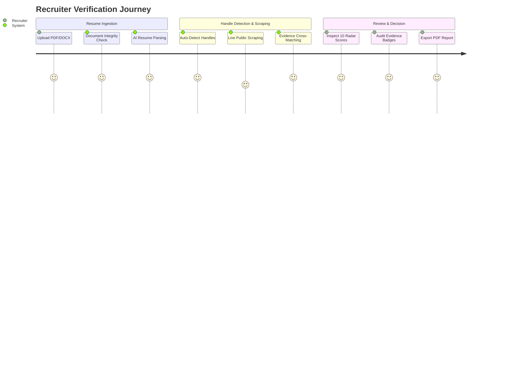

# Product Requirements Document (PRD): 100x Resume

## Document Metadata
- **Product Name**: 100x Resume — Autonomous Candidate Verification Platform
- **Document Version**: 1.0.0
- **Author**: Team grow100x
- **Target Release**: v1.0 Production Ready

---

## 1. Product Overview & Objectives

### 1.1 Objective
To build an automated candidate verification platform that ingests developer resumes, auto-detects and live-scrapes public profiles across major tech platforms, cross-verifies reported skills and projects against real public evidence, and outputs a transparent 10-metric radar score and recruiter-ready PDF report.

### 1.2 Success Metrics & KPIs
- **Verification Speed**: Complete multi-platform scraping & scoring in < 30 seconds per candidate.
- **Evidence Precision**: > 95% accuracy in matching resume skills/projects to public GitHub repositories.
- **Recruiter Efficiency**: Reduce initial candidate screening time from 20 minutes to under 2 minutes per resume.
- **System Availability**: 99.9% uptime with graceful degradation via deterministic mock fallbacks during API rate limits.

---

## 2. User Personas & Core Journeys

### Persona 1: Technical Recruiter (Alex)
- **Goal**: Quickly screen hundreds of incoming applicant resumes and verify if claimed skills are backed by actual code.
- **Workflow**: Uploads resume PDF/DOCX → Views auto-detected handles → Clicks "Run verification" → Audits 10 radar scores & evidence confidence badges → Downloads PDF for the hiring manager.

### Persona 2: Engineering Hiring Manager (Devon)
- **Goal**: Perform a deep-dive technical audit before committing developer team hours to a 45-minute technical screen.
- **Workflow**: Receives 100x Resume report URL → Examines GitHub commit activity, DSA Depth breakdown, and project repo verification status.

### Persona 3: HR Operations Lead (Sarah)
- **Goal**: Rank and sort cohort-level candidate pools (e.g., 50 campus hire applicants) efficiently.
- **Workflow**: Navigates to `/hr` → Drops N resumes at once → Executes batch connection and validation → Reviews ranked leaderboard by Overall Score.

---

## 3. Functional Requirements (FRs)

### FR-1: Resume Ingestion & Parsing
- **FR-1.1**: Support upload of PDF (`.pdf`) and Microsoft Word (`.docx`) file formats up to 10MB.
- **FR-1.2**: Text extraction utilizing `PyMuPDF` (PDF) and `python-docx` (DOCX), falling back to `pdfminer.six`.
- **FR-1.3**: Document Integrity Audit: Scan raw text for hidden zero-width spaces, white-text keyword stuffing, and prompt-injection instructions trying to manipulate AI scoring.
- **FR-1.4**: Categorize parsed skills into 10 structured buckets: *Programming Languages, Frontend, Backend, Databases, DevOps, Cloud, AI/ML, Mobile, Tools, Testing*.

### FR-2: Profile Handle Detection & Auto-Connection
- **FR-2.1**: Regex and string matching across parsed resume text and personal links to detect public handles for:
  - GitHub (`github.com/<username>`)
  - LinkedIn (`linkedin.com/in/<username>`)
  - LeetCode (`leetcode.com/<username>`)
  - HackerRank (`hackerrank.com/<username>`)
  - InterviewBit (`interviewbit.com/profile/<username>`)
- **FR-2.2**: Allow manual handle correction/input if auto-detection misses a handle or candidate uses a different alias.

### FR-3: Live Public Platform Scraping
- **FR-3.1**: **GitHub**: Collect public repos, total commits, stargazers, forks, primary languages, contribution graph, and repository metadata.
- **FR-3.2**: **LeetCode**: Query GraphQL endpoint for total solved, difficulty breakdown (Easy/Medium/Hard), global ranking, and acceptance rate.
- **FR-3.3**: **HackerRank**: Query REST API for badge counts, stars per domain (Algorithms, Python, SQL), and global rank.
- **FR-3.4**: **InterviewBit**: Query REST API for score, institute rank, and solved problems count.
- **FR-3.5**: **LinkedIn**: Headless Playwright scraper for public headline, experience history, education, and certifications.
- **FR-3.6**: **Cache & Fallback**: Implement a 1-hour TTL cache for scraped metrics. On rate limit or network failure, fall back gracefully to a deterministic mock generator.

### FR-4: Cross-Verification & Evidence Matching Engine
- **FR-4.1**: Compare each parsed skill and project against scraped GitHub repositories and code commits.
- **FR-4.2**: Assign an **Evidence Confidence Badge** to each skill and project:
  - `Verified` (Direct code evidence in public GitHub repos + commits)
  - `Strong` (High relevance in public projects and top platform badges)
  - `Partial` (Mentioned in profile/topics but limited direct source code)
  - `Limited` (Minimal public activity detected)
  - `No Evidence` (Claimed on resume but zero public evidence found)

### FR-5: Explainable 10-Metric Radar Scoring
Compute 10 normalized scores (0 to 100):
1. **Completeness**: Ratio of populated resume sections (contact, skills, experience, projects, education).
2. **Credibility**: Document integrity score & cross-platform handle consistency.
3. **Technical Strength**: Skill diversity across languages, frameworks, databases, and infrastructure.
4. **GitHub Engineering**: Repositories, stars, forks, commit frequency, and language spread.
5. **Coding Proficiency**: Aggregated problem-solving output across LeetCode, HackerRank, InterviewBit.
6. **Project Depth**: Live demos, deployment links, API integrations, and code structure.
7. **Open Source Impact**: Stargazers, forks, external repo contributions.
8. **Documentation Quality**: Readme completeness, project descriptions, repository architecture notes.
9. **Continuous Learning**: Recent activity frequency (commits/solved problems within last 6 months).
10. **Overall Rating**: Weighted composite score of all dimensions.

### FR-6: DSA Depth Index
Aggregate problem-solving stats into a unified DSA Index:
$$\text{DSA Index} = w_1 \cdot S_{\text{LeetCode}} + w_2 \cdot S_{\text{HackerRank}} + w_3 \cdot S_{\text{InterviewBit}}$$
where scores are difficulty-weighted (Hard = 3x, Medium = 2x, Easy = 1x).

### FR-7: Real-Time SSE Pipeline
- Expose an SSE endpoint (`POST /api/analysis/run`) returning real-time progress events:
  - `parsing` → `detecting` → `scraping` → `verifying` → `scoring` → `complete`.

### FR-8: HR Batch Candidate Management
- Drag-and-drop multi-file upload (`/hr`).
- Batch auto-connection and parallel verification execution.
- Interactive filterable, sortable candidate ranking table.

### FR-9: Report Generation & Export
- Interactive web report view (`/report/[id]`) featuring radar charts, evidence badges, and AI summary.
- Server-side PDF export via ReportLab (`GET /api/report/{id}/pdf`) rendering a 2-page print-ready document.

---

## 4. Non-Functional Requirements (NFRs)

| NFR Category | Requirement Specification |
|---|---|
| **Performance** | Web page load < 1.5s; full verification pipeline < 30s; PDF generation < 3s. |
| **Scalability** | Asynchronous non-blocking I/O using FastAPI `asyncio` and Next.js App Router. |
| **Reliability** | 99.9% availability; zero hard crashes via fallback mocks during API outages. |
| **Security** | File upload sanitization; white-text prompt-injection guardrails; CORS restricted to frontend origins. |
| **Privacy & GDPR** | Strictly scrapes publicly accessible handles; no private passwords or OAuth tokens stored. |
| **Usability** | High-contrast dark theme, accessible radar charts, fully responsive across desktop & mobile. |

---

## 5. Out of Scope for v1.0
- Private GitHub repository access requiring user OAuth login.
- Automated code plagiarism detection across candidate repos.
- Direct integration with commercial ATS platforms (Workday, Greenhouse).
