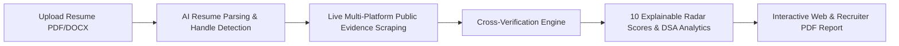

# Project Idea: 100x Resume — Autonomous Candidate Verification Platform

## Executive Summary
**100x Resume** is an AI-powered candidate verification platform designed to eliminate resume fraud, inflated technical claims, and recruiter screening fatigue. Traditional Applicant Tracking Systems (ATS) rely on passive keyword matching on unverified self-reported resumes. 100x Resume shifts hiring from *self-reported claims* to *verifiable public evidence*.

By parsing candidate resumes (PDF/DOCX), auto-detecting public developer profiles (GitHub, LeetCode, HackerRank, InterviewBit, LinkedIn), live-scraping public metrics, and running cross-reference verification algorithms, 100x Resume computes **10 explainable radar scores** and a weighted **DSA Depth rating**. It culminates in an interactive web report and a recruiter-ready PDF export.

---

## 1. Problem Statement

### 1.1 Resume Claim Inflation & Fraud
- Up to 85% of tech resumes contain exaggerated or unverified claims regarding skills, project experience, and competitive coding ranks.
- Candidates often list advanced technologies (e.g., Kubernetes, PyTorch, React) without having committed a single line of public code or built verifiable projects using them.

### 1.2 Keyword ATS Limitations
- Keyword-matching ATS tools favor candidates who "game" the system with resume keyword stuffing.
- Qualified candidates with strong public code bases are frequently filtered out by rigid string-matching algorithms.

### 1.3 Screening Fatigue & Manual Audit Overhead
- Technical recruiters and hiring managers spend 15–30 minutes per candidate manually verifying GitHub repositories, LeetCode problem counts, and LinkedIn employment histories.
- Manual cross-referencing across 5+ developer platforms creates massive hiring bottlenecks.

---

## 2. The 100x Resume Solution

100x Resume introduces an autonomous **Evidence-Based Screening Pipeline**:

### Core Value Pillars
1. **Automated Evidence Collection**: Scrapes public developer profiles across GitHub (REST/GraphQL), LeetCode (GraphQL), HackerRank (REST), InterviewBit (REST), and LinkedIn (Playwright headless web browser) without requiring candidate login.
2. **Explainable 0–100 Radar Scoring**: Replaces black-box ATS scores with 10 transparent dimensions: Completeness, Credibility, Technical Strength, GitHub Engineering, Coding Proficiency, Project Depth, Open Source Impact, Documentation Quality, Continuous Learning, and Overall Rating.
3. **DSA Depth Index**: Aggregates problem-solving metrics across LeetCode, HackerRank, InterviewBit, Codeforces, and CodeChef into a single normalized Data Structures & Algorithms index.
4. **HR Batch Processing**: Enables bulk upload and auto-ranking of multiple candidates to streamline cohort-level technical screening.
5. **Recruiter-Ready Reports**: Generates downloadable PDF reports (via ReportLab) complete with evidence confidence badges (*Verified / Strong / Partial / Limited / No Evidence*).

---

## 3. Target Audience & Market Positioning

| Audience Segment | Primary Pain Point | 100x Resume Solution |
|---|---|---|
| **Technical Recruiters** | High rate of candidate drop-off during manual technical screens | 30-second automated evidence report prior to initial screening call |
| **Engineering Hiring Managers** | Wasted developer interview hours on unverified resume claims | Transparent repository & commit audit with verified project links |
| **HR Operations Teams** | Sorting hundreds of hackathon or campus hire applicants | HR Batch pipeline auto-ranks top candidates by evidence score |
| **Tech Bootcamps & Academies** | Demonstrating job-readiness of graduates to hiring partners | Verifiable candidate portfolio reports with public evidence badges |

---

## 4. Key Differentiators & Unique Selling Points (USPs)

- **Zero Candidate Auth Required**: Relies strictly on public APIs, public profile handles, and web scraping—no OAuth onboarding barrier.
- **Real-Time SSE Verification Pipeline**: Live status feed showing stage-by-stage verification progress (Parsing → Detection → Scraping → Evidence Audit → Scoring → PDF Generation).
- **Document Integrity Guardrails**: Automatically inspects uploaded files for white-text prompt injection, hidden keywords, and structural anomalies.
- **Deterministic Mock Fallback**: Ensures 100% platform availability even when rate-limited by external APIs.

---

## 5. Vision & Future Scope

- **v1.5**: Integration with CodeChef, Codeforces, Kaggle, and StackOverflow public activity.
- **v2.0**: Automated candidate identity verification and background check integration.
- **v3.0**: Enterprise ATS plugin (Greenhouse, Lever, Workday) with real-time candidate verification badges.
