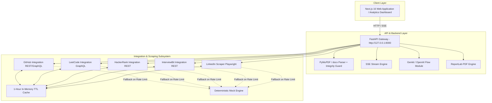

# Software Requirements Specification (SRS): 100x Resume

## 1. Introduction & System Overview

### 1.1 Purpose
This document provides the formal Software Requirements Specification (SRS) for the **100x Resume Candidate Verification Platform**. It details system architecture, API specifications, data structures, verification algorithms, and operational requirements.

### 1.2 System Scope
100x Resume is a full-stack web application comprising:
- **Frontend**: Next.js 16 (React 19, TypeScript, TailwindCSS 4, Turbopack).
- **Backend**: FastAPI (Python 3.12+), Google Genkit flow, PyMuPDF, ReportLab, Playwright.

---

## 2. System Architecture & Topology



---

## 3. Data Dictionary & Pydantic Schemas

### 3.1 `ParsedResume` Schema
```python
class PersonalDetails(BaseModel):
    name: str | None
    email: str | None
    phone: str | None
    location: str | None
    portfolio: str | None
    github: str | None
    linkedin: str | None
    headline: str | None

class SkillsBreakdown(BaseModel):
    programming_languages: list[str]
    frontend: list[str]
    backend: list[str]
    databases: list[str]
    devops: list[str]
    cloud: list[str]
    ai_ml: list[str]
    mobile: list[str]
    tools: list[str]
    testing: list[str]
    other: list[str]

class Project(BaseModel):
    name: str | None
    description: str | None
    tech_stack: list[str]
    features: list[str]
    github_link: str | None
    live_demo: str | None
    apis_used: list[str]
    database: str | None
    deployment: str | None

class ParsedResume(BaseModel):
    personal: PersonalDetails
    education: list[Education]
    experience: list[Experience]
    skills: SkillsBreakdown
    projects: list[Project]
    achievements: list[Achievement]
    raw_text: str
    integrity: IntegrityReport | None
```

### 3.2 `CandidateReport` & `AnalysisBundle` Schema
```python
class EvidenceItem(BaseModel):
    skill_or_project: str
    confidence: Literal["Verified", "Strong", "Partial", "Limited", "No Evidence"]
    evidence_type: str
    details: str
    repo_url: str | None

class AnalysisBundle(BaseModel):
    resume: ParsedResume
    connected_profiles: list[ConnectedProfile]
    scores: dict[str, float]          # 10 scores: 0.0 - 100.0
    dsa_depth: dict[str, Any]         # Weighted problem solving analytics
    evidence: list[EvidenceItem]
    ai_summary: str

class CandidateReport(BaseModel):
    report_id: str
    generated_at: datetime
    analysis: AnalysisBundle
```

---

## 4. API Endpoints & Interfaces

### 4.1 Resume Processing Endpoints

#### `POST /api/resume/upload`
- **Input**: `multipart/form-data` with `file: UploadFile` (`.pdf` or `.docx`).
- **Processing**: Reads bytes, extracts raw text using PyMuPDF/docx, runs document integrity check (white text / hidden prompt injection scan).
- **Output**: `{ "text": str, "filename": str, "integrity": IntegrityReport }`.

#### `POST /api/resume/parse`
- **Input**: `{ "text": str }`.
- **Processing**: Passes text to Genkit/LLM or regex parser to extract structured `ParsedResume`.
- **Output**: `ParsedResume` JSON.

---

### 4.2 Integration & Detection Endpoints

#### `POST /api/integrations/detect`
- **Input**: `ParsedResume` JSON.
- **Processing**: Regex scanner extracts profile handles across 5 target platforms.
- **Output**: `{ "github": str, "linkedin": str, "leetcode": str, "hackerrank": str, "interviewbit": str }`.

#### `POST /api/integrations/connect`
- **Input**: `{ "platform": str, "handle": str, "resume": ParsedResume }`.
- **Processing**: Calls platform collector (or mock fallback if unpopulated/rate-limited).
- **Output**: `ConnectedProfile` JSON.

#### `POST /api/integrations/auto-connect`
- **Input**: `{ "resume": ParsedResume }`.
- **Processing**: Detects handles and collects live profile data for all detected platforms in parallel.
- **Output**: `list[ConnectedProfile]`.

---

### 4.3 Analysis Pipeline & Report Endpoints

#### `POST /api/analysis/run` (SSE Streaming)
- **Input**: `{ "resume": ParsedResume, "profiles": list[ConnectedProfile] }`.
- **Stream Format**: `text/event-stream` sending JSON progress events:
  ```json
  { "stage": "verifying", "progress": 65, "message": "Cross-matching GitHub repos with claimed projects..." }
  ```
- **Terminal Event**: `{ "stage": "complete", "progress": 100, "report_id": "rep_123456" }`.

#### `GET /api/report/{id}`
- **Output**: `CandidateReport` JSON object retrieved from local JSON storage (`backend/data/reports/`).

#### `GET /api/report/{id}/pdf`
- **Processing**: ReportLab canvas builder renders 2-page PDF report with header metrics, radar chart visual, evidence table, and AI executive summary.
- **Output**: Binary `application/pdf` download stream (`Content-Disposition: attachment; filename="CandidateReport_<id>.pdf"`).

---

## 5. Algorithmic Specifications

### 5.1 Handle Detection Regexes
```python
REGEX_PATTERNS = {
    "github": r"(?:github\.com\/)([a-zA-Z0-9\-_]+)",
    "linkedin": r"(?:linkedin\.com\/in\/)([a-zA-Z0-9\-_]+)",
    "leetcode": r"(?:leetcode\.com\/)([a-zA-Z0-9\-_]+)",
    "hackerrank": r"(?:hackerrank\.com\/)([a-zA-Z0-9\-_]+)",
    "interviewbit": r"(?:interviewbit\.com\/profile\/)([a-zA-Z0-9\-_]+)"
}
```

### 5.2 DSA Depth Calculation Formula
The Data Structures & Algorithms depth score is derived from weighted platform contributions:

$$\text{LeetCode Weighted} = 1.0 \times \text{Easy} + 2.5 \times \text{Medium} + 5.0 \times \text{Hard}$$

$$\text{DSA Score} = \min\left(100, \, \frac{\text{LeetCode Weighted} + 1.5 \times \text{InterviewBit Solved} + 10 \times \text{HackerRank Stars}}{15}\right)$$

---

## 6. System Quality & Operational Requirements

### 6.1 Resilience & Fallbacks
- All external API calls (GitHub, LeetCode GraphQL, HackerRank, InterviewBit, LinkedIn) are wrapped in `try/except` handlers with a 5.0s timeout per call.
- On HTTP 429 (Rate Limit), timeout, or missing handle, the system executes `DeterministicMockEngine` using candidate name hash to yield consistent, predictable demo metrics without throwing uncaught exceptions.

### 6.2 Security & Data Privacy
- **Strict File Type Validation**: Restricts upload headers to `application/pdf` and `application/vnd.openxmlformats-officedocument.wordprocessingml.document`.
- **CORS Policy**: Configured in FastAPI middleware to whitelist `http://localhost:3000` and production frontend URLs.
- **Data Minimization**: Stores generated report JSON files locally under `backend/data/reports/` with unique UUIDs. No sensitive PII is shared externally.
